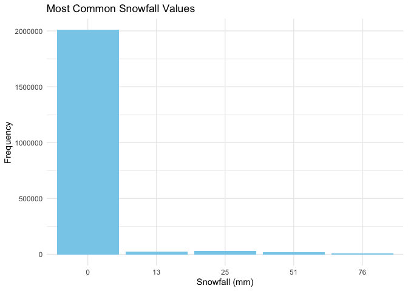
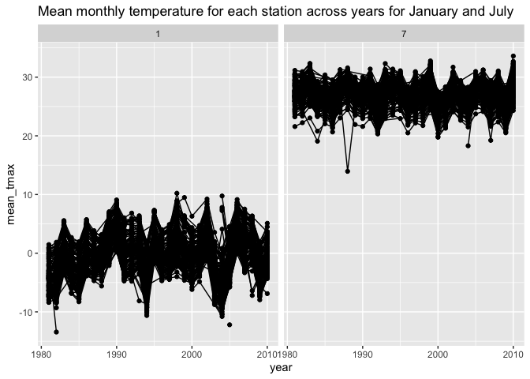
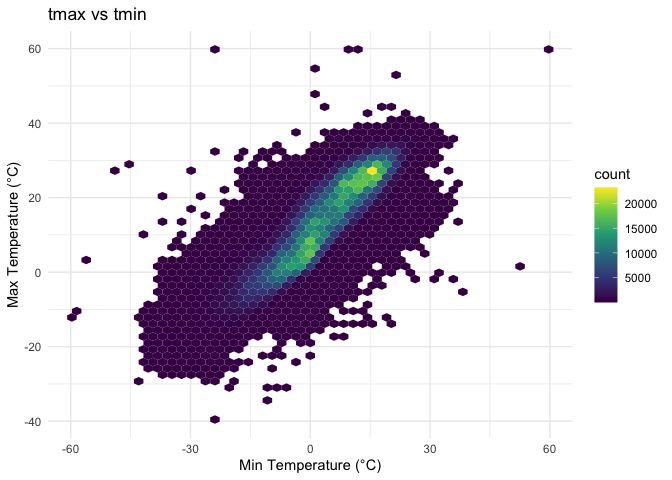
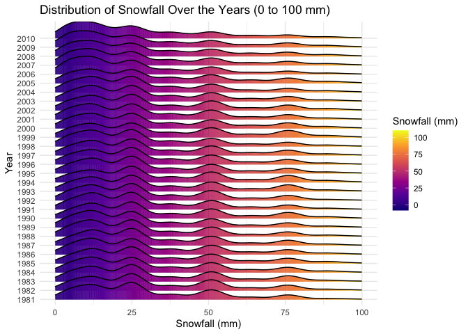

p8105_hw3_zl3543
================
Zihan Lin

### Problem 1

``` r
library(p8105.datasets)
data("ny_noaa")
```

This dataset contains 2595176 rows and 7 columns. Variables include
weather station id, date of observation, (tenths of mm), snowfall (mm),
snow depth (mm), and min and max temperature (tenths of degrees C).

Below we clean the data, creating separate variables for year, month,
and day and converting `tmax` and `tmin` to numeric. We find that 0 is
the most commonly observed value for snowfall. This is because most days
of the year, it does not snow at all in NY. The second most commonly
observed value is `NA`, indicating missingness. Other common values are
13, 25, and 51, suggesting that snowfall is originally recorded in
fractions of an inch and converted to mm.

``` r
# Data cleaning: separate year, month, and day, and convert units
ny_noaa %>% 
  count(snow) %>%
  arrange(desc(n))
```

    ## # A tibble: 282 × 2
    ##     snow       n
    ##    <int>   <int>
    ##  1     0 2008508
    ##  2    NA  381221
    ##  3    25   31022
    ##  4    13   23095
    ##  5    51   18274
    ##  6    76   10173
    ##  7     8    9962
    ##  8     5    9748
    ##  9    38    9197
    ## 10     3    8790
    ## # ℹ 272 more rows

``` r
ny_noaa_clean <-
  ny_noaa %>% 
  separate(date, into = c("year", "month", "day"), convert = TRUE) %>% 
  mutate(
    tmax = as.numeric(tmax) / 10,   # Convert from tenths of degrees C to degrees C
    tmin = as.numeric(tmin) / 10,   # Convert from tenths of degrees C to degrees C
    prcp = as.numeric(prcp) / 10    # Convert from tenths of mm to mm
  )

# Find the most common snowfall values
snowfall_common <- ny_noaa_clean %>%
  filter(!is.na(snow)) %>%
  count(snow) %>%
  arrange(desc(n)) %>%
  head(5)

print(snowfall_common)
```

    ## # A tibble: 5 × 2
    ##    snow       n
    ##   <int>   <int>
    ## 1     0 2008508
    ## 2    25   31022
    ## 3    13   23095
    ## 4    51   18274
    ## 5    76   10173

``` r
# Plot the most common snowfall values
ggplot(snowfall_common, aes(x = factor(snow), y = n)) +
  geom_bar(stat = "identity", fill = "skyblue") +
  labs(
    title = "Most Common Snowfall Values",
    x = "Snowfall (mm)",
    y = "Frequency"
  ) +
  theme_minimal()
```

<!-- -->

Below is a two-panel plot showing the average max temperature in January
and in July in each station across years. As expected, the mean
temperature in January is much lower than the mean temperature in July
for all stations and across all years. All stations appear to follow
similar trends of temperature peaks and valleys within a month across
the years, i.e. when one station has a high monthly mean temperature for
a given year, most other stations also have a high monthly mean
temperature for that year. We do see one uncharacteristically cold
station in July of 1987 or 1988, as well as a few other less drastic
outliers.

``` r
# Create a plot for average max temperature in January and July
ny_noaa_clean %>% 
  group_by(id, year, month) %>% 
  filter(month %in% c(1, 7)) %>% 
  summarize(mean_tmax = mean(tmax, na.rm = TRUE, color = id)) %>% 
  ggplot(aes(x = year, y = mean_tmax, group = id)) + geom_point() + geom_path() +
  facet_grid(~month) +
  labs(title = "Mean monthly temperature for each station across years for January and July")
```

    ## `summarise()` has grouped output by 'id', 'year'. You can override using the
    ## `.groups` argument.

    ## Warning: Removed 5970 rows containing missing values or values outside the scale range
    ## (`geom_point()`).

    ## Warning: Removed 5931 rows containing missing values or values outside the scale range
    ## (`geom_path()`).

<!-- -->

Below we show a two-panel plot including (i) a hex plot of `tmax` vs
`tmin` for the full dataset; and (ii) a ridge plot showing the
distribution of snowfall values (in mm) greater than 0 and less than 100
separately by year.

From the hex plot we see that while there is some variability, the
majority of the data cluster tightly in the center of the distribution.
In relatively rare cases, it seems that `tmax` is less than `tmin`,
which raises questions about data recording and quality.

From the ridge plot, we see a multimodal density of snowfall within a
given year. Most stations see between 0 and 35 mm of snow in a year.
Then there is a another group of stations that see about 45 mm of snow,
and another group that sees nearly 80 mm. It is likely this
multimodality stems from the conversion of measurements in one system
(fractions of an inch) to another (using the metric system), which was
also noted in the table of common values.

``` r
# Hexbin plot for tmax vs tmin
ggplot(ny_noaa_clean %>% filter(!is.na(tmax) & !is.na(tmin)), aes(x = tmin, y = tmax)) +
  geom_hex(bins = 50) +
  labs(
    title = "tmax vs tmin",
    x = "Min Temperature (°C)",
    y = "Max Temperature (°C)"
  ) +
  scale_fill_viridis_c() +  
  theme_minimal()
```

<!-- -->

``` r
# Ridgeline plot for snowfall distribution by year (0 to 100 mm)
ny_noaa_clean %>%
  filter(snow > 0 & snow <= 100) %>%  # Filter to include snowfall between 0 and 100 mm
  ggplot(aes(x = snow, y = factor(year), fill = after_stat(x))) +  # Use after_stat(x)
  geom_density_ridges_gradient(scale = 2, rel_min_height = 0.01) +  # Gradient color
  labs(
    title = "Distribution of Snowfall Over the Years (0 to 100 mm)",
    x = "Snowfall (mm)",
    y = "Year"
  ) +
  scale_fill_viridis_c(option = "C", name = "Snowfall (mm)") +  # Apply viridis color palette
  theme_ridges() +
  theme_minimal() +
  xlim(0, 100) +  # Set x-axis limits to range from 0 to 100 mm
  theme(legend.position = "right")  # Legend positioned to the right
```

    ## Picking joint bandwidth of 3.76

<!-- -->
