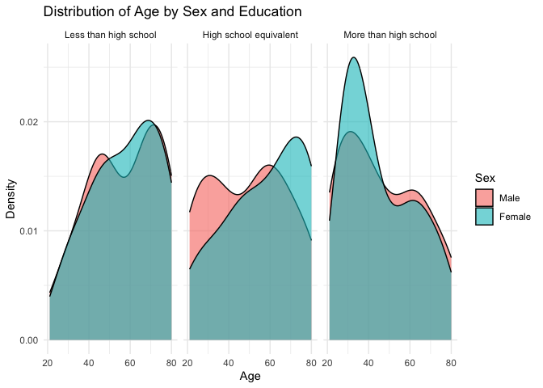
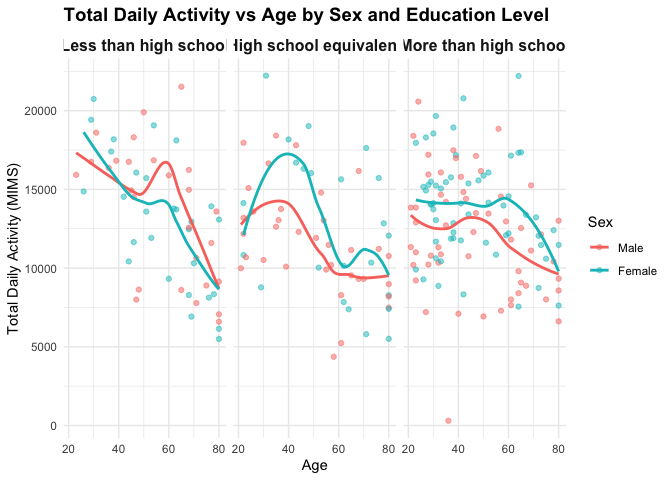
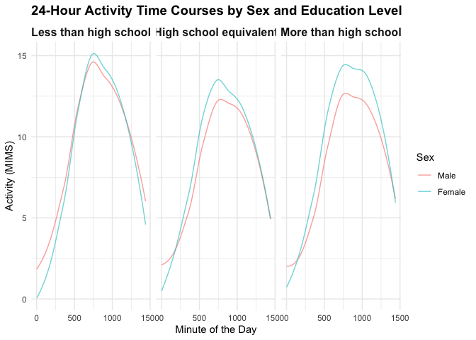
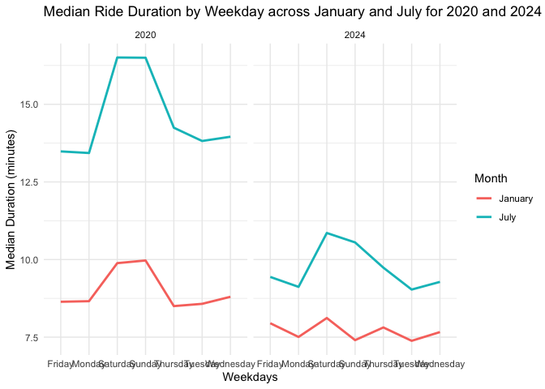
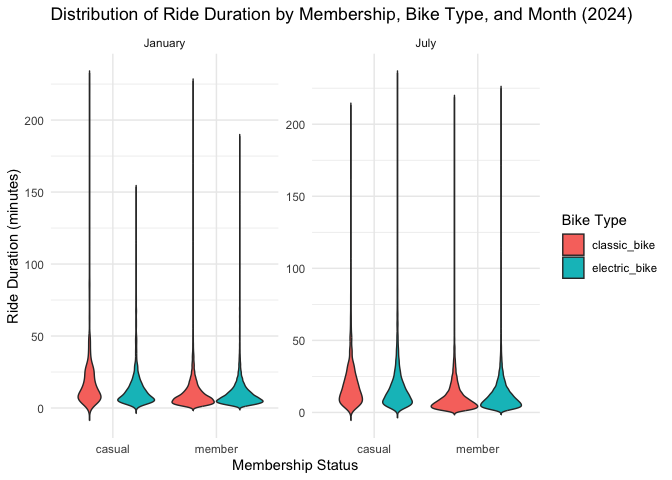

p8105_hw3_zl3543
================
Zihan Lin

### Problem 1

``` r
library(p8105.datasets)
data("ny_noaa")
```

This dataset contains 2595176 rows and 7 columns. Variables include
weather station id, date of observation, (tenths of mm), snowfall (mm),
snow depth (mm), and min and max temperature (tenths of degrees C).

Below we clean the data, creating separate variables for year, month,
and day and converting `tmax` and `tmin` to numeric. We find that 0 is
the most commonly observed value for snowfall. This is because most days
of the year, it does not snow at all in NY. The second most commonly
observed value is `NA`, indicating missingness. Other common values are
13, 25, and 51, suggesting that snowfall is originally recorded in
fractions of an inch and converted to mm.

``` r
# Data cleaning: separate year, month, and day, and convert units
ny_noaa %>% 
  count(snow) %>%
  arrange(desc(n))
```

    ## # A tibble: 282 × 2
    ##     snow       n
    ##    <int>   <int>
    ##  1     0 2008508
    ##  2    NA  381221
    ##  3    25   31022
    ##  4    13   23095
    ##  5    51   18274
    ##  6    76   10173
    ##  7     8    9962
    ##  8     5    9748
    ##  9    38    9197
    ## 10     3    8790
    ## # ℹ 272 more rows

``` r
ny_noaa_clean <-
  ny_noaa %>% 
  separate(date, into = c("year", "month", "day"), convert = TRUE) %>% 
  mutate(
    tmax = as.numeric(tmax) / 10,   # Convert from tenths of degrees C to degrees C
    tmin = as.numeric(tmin) / 10,   # Convert from tenths of degrees C to degrees C
    prcp = as.numeric(prcp) / 10    # Convert from tenths of mm to mm
  )

# Find the most common snowfall values
snowfall_common <- ny_noaa_clean %>%
  filter(!is.na(snow)) %>%
  count(snow) %>%
  arrange(desc(n)) %>%
  head(5)

print(snowfall_common)
```

    ## # A tibble: 5 × 2
    ##    snow       n
    ##   <int>   <int>
    ## 1     0 2008508
    ## 2    25   31022
    ## 3    13   23095
    ## 4    51   18274
    ## 5    76   10173

``` r
# Plot the most common snowfall values
ggplot(snowfall_common, aes(x = factor(snow), y = n)) +
  geom_bar(stat = "identity", fill = "skyblue") +
  labs(
    title = "Most Common Snowfall Values",
    x = "Snowfall (mm)",
    y = "Frequency"
  ) +
  theme_minimal()
```

<!-- -->
Below is a two-panel plot showing the average max temperature in January
and in July in each station across years. As expected, the mean
temperature in January is much lower than the mean temperature in July
for all stations and across all years. All stations appear to follow
similar trends of temperature peaks and valleys within a month across
the years, i.e. when one station has a high monthly mean temperature for
a given year, most other stations also have a high monthly mean
temperature for that year. We do see one uncharacteristically cold
station in July of 1987 or 1988, as well as a few other less drastic
outliers.

``` r
# Create a plot for average max temperature in January and July
ny_noaa_clean %>% 
  group_by(id, year, month) %>% 
  filter(month %in% c(1, 7)) %>% 
  summarize(mean_tmax = mean(tmax, na.rm = TRUE, color = id)) %>% 
  ggplot(aes(x = year, y = mean_tmax, group = id)) + geom_point() + geom_path() +
  facet_grid(~month) +
  labs(title = "Mean monthly temperature for each station across years for January and July")
```

    ## `summarise()` has grouped output by 'id', 'year'. You can override using the
    ## `.groups` argument.

    ## Warning: Removed 5970 rows containing missing values or values outside the scale range
    ## (`geom_point()`).

    ## Warning: Removed 5931 rows containing missing values or values outside the scale range
    ## (`geom_path()`).

<!-- -->
Below we show a two-panel plot including (i) a hex plot of `tmax` vs
`tmin` for the full dataset; and (ii) a ridge plot showing the
distribution of snowfall values (in mm) greater than 0 and less than 100
separately by year.

From the hex plot we see that while there is some variability, the
majority of the data cluster tightly in the center of the distribution.
In relatively rare cases, it seems that `tmax` is less than `tmin`,
which raises questions about data recording and quality.

From the ridge plot, we see a multimodal density of snowfall within a
given year. Most stations see between 0 and 35 mm of snow in a year.
Then there is a another group of stations that see about 45 mm of snow,
and another group that sees nearly 80 mm. It is likely this
multimodality stems from the conversion of measurements in one system
(fractions of an inch) to another (using the metric system), which was
also noted in the table of common values.

``` r
# Hexbin plot for tmax vs tmin
ggplot(ny_noaa_clean %>% filter(!is.na(tmax) & !is.na(tmin)), aes(x = tmin, y = tmax)) +
  geom_hex(bins = 50) +
  labs(
    title = "tmax vs tmin",
    x = "Min Temperature (°C)",
    y = "Max Temperature (°C)"
  ) +
  scale_fill_viridis_c() +  
  theme_minimal()
```

<!-- -->

``` r
# Ridgeline plot for snowfall distribution by year (0 to 100 mm)
ny_noaa_clean %>%
  filter(snow > 0 & snow <= 100) %>%  # Filter to include snowfall between 0 and 100 mm
  ggplot(aes(x = snow, y = factor(year), fill = after_stat(x))) +  # Use after_stat(x)
  geom_density_ridges_gradient(scale = 2, rel_min_height = 0.01) +  # Gradient color
  labs(
    title = "Distribution of Snowfall Over the Years (0 to 100 mm)",
    x = "Snowfall (mm)",
    y = "Year"
  ) +
  scale_fill_viridis_c(option = "C", name = "Snowfall (mm)") +  # Apply viridis color palette
  theme_ridges() +
  theme_minimal() +
  xlim(0, 100) +  # Set x-axis limits to range from 0 to 100 mm
  theme(legend.position = "right")  # Legend positioned to the right
```

    ## Picking joint bandwidth of 3.76

<!-- -->

### Problem 2

Load, tidy, merge, and otherwise organize the data sets, which includes
all originally observed variables; exclude participants less than 21
years of age, and those with missing demographic data; and encode data
with reasonable variable classes

``` r
# Load demographic and accelerometer datasets
covar_data <- read_csv("data/nhanes_covar.csv", skip = 4)
```

    ## Rows: 250 Columns: 5
    ## ── Column specification ────────────────────────────────────────────────────────
    ## Delimiter: ","
    ## dbl (5): SEQN, sex, age, BMI, education
    ## 
    ## ℹ Use `spec()` to retrieve the full column specification for this data.
    ## ℹ Specify the column types or set `show_col_types = FALSE` to quiet this message.

``` r
accel_data <- read_csv("data/nhanes_accel.csv")
```

    ## Rows: 250 Columns: 1441
    ## ── Column specification ────────────────────────────────────────────────────────
    ## Delimiter: ","
    ## dbl (1441): SEQN, min1, min2, min3, min4, min5, min6, min7, min8, min9, min1...
    ## 
    ## ℹ Use `spec()` to retrieve the full column specification for this data.
    ## ℹ Specify the column types or set `show_col_types = FALSE` to quiet this message.

``` r
# Rename the columns for the demographic data for easier access
colnames(covar_data) <- c("SEQN", "sex", "age", "BMI", "education")

# Merge the two datasets using the SEQN column
merged_data <- inner_join(accel_data, covar_data, by = "SEQN")

# Filter participants who are older than 21 and remove rows with missing values
filtered_data <- merged_data %>%
  filter(age >= 21) %>%
  drop_na()

# Check the structure of the filtered data
str(filtered_data)
```

    ## tibble [228 × 1,445] (S3: tbl_df/tbl/data.frame)
    ##  $ SEQN     : num [1:228] 62161 62164 62169 62174 62177 ...
    ##  $ min1     : num [1:228] 1.11 1.92 5.85 5.42 6.14 ...
    ##  $ min2     : num [1:228] 3.12 1.67 5.18 3.48 8.06 ...
    ##  $ min3     : num [1:228] 1.47 2.38 4.76 3.72 9.99 ...
    ##  $ min4     : num [1:228] 0.938 0.935 6.482 3.808 6.598 ...
    ##  $ min5     : num [1:228] 1.6 2.59 6.85 6.85 4.57 ...
    ##  $ min6     : num [1:228] 0.145 5.221 7.242 4.449 2.783 ...
    ##  $ min7     : num [1:228] 2.1 2.393 6.115 0.561 7.104 ...
    ##  $ min8     : num [1:228] 0.509 4.902 7.484 1.608 7.253 ...
    ##  $ min9     : num [1:228] 1.632 1.968 5.471 0.698 10.127 ...
    ##  $ min10    : num [1:228] 1.2 3.13 6.49 2.72 7.49 ...
    ##  $ min11    : num [1:228] 0.947 2.771 5.135 4.845 2.718 ...
    ##  $ min12    : num [1:228] 0.0263 2.4539 3.5134 0.5777 2.3941 ...
    ##  $ min13    : num [1:228] 0.0552 2.1964 5.4329 1.174 2.2013 ...
    ##  $ min14    : num [1:228] 0.037 3.079 3.836 2.801 0.85 ...
    ##  $ min15    : num [1:228] 2.1 7.72 10.22 1.06 3.3 ...
    ##  $ min16    : num [1:228] 0.543 9.464 6.942 0.029 2.918 ...
    ##  $ min17    : num [1:228] 0.0915 6.8507 5.9619 0.9488 3.6746 ...
    ##  $ min18    : num [1:228] 0.97 5.5 8.16 2.68 7.59 ...
    ##  $ min19    : num [1:228] 0.814 6.11 14.2 4.881 6.248 ...
    ##  $ min20    : num [1:228] 0.965 3.443 8.693 0.127 5.79 ...
    ##  $ min21    : num [1:228] 0.0478 3.5679 25.992 2.5968 3.3457 ...
    ##  $ min22    : num [1:228] 1.86 1.47 9.24 5.02 3.32 ...
    ##  $ min23    : num [1:228] 1.08 3.1 6.63 1.65 3.01 ...
    ##  $ min24    : num [1:228] 1.03 1.77 5.1 5.26 4.18 ...
    ##  $ min25    : num [1:228] 1.23 3.28 4.78 4.72 2.24 ...
    ##  $ min26    : num [1:228] 2.29 4.53 8.48 5.02 3.79 ...
    ##  $ min27    : num [1:228] 0.0607 2.5034 7.4079 4.7187 5.7221 ...
    ##  $ min28    : num [1:228] 0.0533 1.3331 4.4674 6.8562 5.5306 ...
    ##  $ min29    : num [1:228] 0.103 0.765 5.384 2.806 12.468 ...
    ##  $ min30    : num [1:228] 0.0907 5.9849 3.7921 4.3602 5.6324 ...
    ##  $ min31    : num [1:228] 0.309 3.25 5.987 3.357 1.305 ...
    ##  $ min32    : num [1:228] 0.401 0.745 4.218 1.742 2.748 ...
    ##  $ min33    : num [1:228] 1.234 0.99 3.491 1.998 0.395 ...
    ##  $ min34    : num [1:228] 0.033 1.342 3.624 0.98 1.554 ...
    ##  $ min35    : num [1:228] 3.0613 3.5911 5.953 0.0155 0.6207 ...
    ##  $ min36    : num [1:228] 1.723 5.063 7.598 0.457 0.247 ...
    ##  $ min37    : num [1:228] 0.0605 4.642 7.6967 0.6662 1.5099 ...
    ##  $ min38    : num [1:228] 4.22 5.02 6.34 1.05 1.69 ...
    ##  $ min39    : num [1:228] 0.805 2.664 20.129 0.02 3.07 ...
    ##  $ min40    : num [1:228] 0.898 1.363 10.044 0.507 4.033 ...
    ##  $ min41    : num [1:228] 1.7445 2.4273 4.4081 0.0427 2.1993 ...
    ##  $ min42    : num [1:228] 1.506 5.165 8.664 0.756 0.69 ...
    ##  $ min43    : num [1:228] 0.857 6.527 10.432 1.763 1.255 ...
    ##  $ min44    : num [1:228] 1.03 3.22 6.75 3.29 3.02 ...
    ##  $ min45    : num [1:228] 0.0495 6.4894 3.8894 0.0893 2.7264 ...
    ##  $ min46    : num [1:228] 0.137 6.602 3.976 0.732 7.687 ...
    ##  $ min47    : num [1:228] 0.911 2.535 3.47 1.363 1.78 ...
    ##  $ min48    : num [1:228] 0.299 3.532 5.168 0.117 1.399 ...
    ##  $ min49    : num [1:228] 0.364 2.365 5.692 0.759 1.329 ...
    ##  $ min50    : num [1:228] 0.0455 1.0396 5.194 0.5965 3.2546 ...
    ##  $ min51    : num [1:228] 0.0307 0.805 3.5296 0.419 2.827 ...
    ##  $ min52    : num [1:228] 2.216 0.722 6.174 0.147 2.251 ...
    ##  $ min53    : num [1:228] 0.0577 1.1586 7.8921 1.7413 0.3917 ...
    ##  $ min54    : num [1:228] 1.216 1.243 7.589 2.286 0.631 ...
    ##  $ min55    : num [1:228] 0.0765 1.2767 6.3474 4.3313 0.7009 ...
    ##  $ min56    : num [1:228] 0.0638 1.2551 5.1994 0.1208 1 ...
    ##  $ min57    : num [1:228] 0.532 0.6137 5.814 0.0183 2.2229 ...
    ##  $ min58    : num [1:228] 0.0448 0.7019 8.0919 0.698 3.5767 ...
    ##  $ min59    : num [1:228] 0.094 4.954 6.623 0.084 2.911 ...
    ##  $ min60    : num [1:228] 0.0273 4.0599 5.9017 0.5968 5.567 ...
    ##  $ min61    : num [1:228] 0.922 9.251 6.438 0.015 2.355 ...
    ##  $ min62    : num [1:228] 0.0378 2.8973 6.4271 0.0157 4.0069 ...
    ##  $ min63    : num [1:228] 0.15 1.871 5.103 0.183 3.47 ...
    ##  $ min64    : num [1:228] 0.0922 1.1697 5.1356 0.7497 2.7854 ...
    ##  $ min65    : num [1:228] 0.378 2.625 4.541 0.031 5.24 ...
    ##  $ min66    : num [1:228] 0.0377 2.476 5.7209 0.0307 4.8513 ...
    ##  $ min67    : num [1:228] 1.1283 2.3359 4.7034 0.0422 3.4093 ...
    ##  $ min68    : num [1:228] 0.123 4.983 6.667 0.873 4.443 ...
    ##  $ min69    : num [1:228] 1.21 3.26 5.61 5.84 7.37 ...
    ##  $ min70    : num [1:228] 0.0503 4.6211 3.496 6.2575 2.9409 ...
    ##  $ min71    : num [1:228] 0.0243 3.8281 3.5521 4.0658 3.1709 ...
    ##  $ min72    : num [1:228] 0.0543 2.0437 6.0114 4.9895 3.302 ...
    ##  $ min73    : num [1:228] 0.0273 1.0824 4.949 0.4662 10.2747 ...
    ##  $ min74    : num [1:228] 0.68 6.02 5.52 1.11 1.14 ...
    ##  $ min75    : num [1:228] 0.0512 5.1124 5.4481 6.5372 2.0353 ...
    ##  $ min76    : num [1:228] 0.747 7.646 6.168 5.703 2.457 ...
    ##  $ min77    : num [1:228] 0.743 6.181 5.776 0.41 1.793 ...
    ##  $ min78    : num [1:228] 1.26 4.77 10.52 1.04 3.82 ...
    ##  $ min79    : num [1:228] 0.854 4.373 7.089 0.359 3.331 ...
    ##  $ min80    : num [1:228] 1.166 4.56 7.959 0.931 4.177 ...
    ##  $ min81    : num [1:228] 0.206 1.921 7.116 0.237 5.08 ...
    ##  $ min82    : num [1:228] 0.824 2.648 4.855 1.529 2.02 ...
    ##  $ min83    : num [1:228] 0.115 2.168 7.518 5.599 5.898 ...
    ##  $ min84    : num [1:228] 1.06 1.32 9.21 3.2 3.3 ...
    ##  $ min85    : num [1:228] 3.76 2.75 5.03 3.3 1.23 ...
    ##  $ min86    : num [1:228] 6.86 1.85 4.4 2.96 6.24 ...
    ##  $ min87    : num [1:228] 5.949 1.477 9.568 0.033 0.89 ...
    ##  $ min88    : num [1:228] 1.593 0.715 9.112 0.394 0.815 ...
    ##  $ min89    : num [1:228] 0.353 1.552 9.95 1.137 0.102 ...
    ##  $ min90    : num [1:228] 0.768 1.583 9.702 0.212 1.515 ...
    ##  $ min91    : num [1:228] 0.275 1.4 4.508 0.527 4.04 ...
    ##  $ min92    : num [1:228] 0.0292 3.4963 7.5771 2.1612 2.8986 ...
    ##  $ min93    : num [1:228] 1.992 0.976 12.136 3.366 1.785 ...
    ##  $ min94    : num [1:228] 0.0522 3.4009 13.8067 0.1887 0.539 ...
    ##  $ min95    : num [1:228] 0.876 3.498 15.463 1.777 3.396 ...
    ##  $ min96    : num [1:228] 0.425 3.591 10.193 0.621 2.27 ...
    ##  $ min97    : num [1:228] 1.26 1.11 16.74 2.27 1.06 ...
    ##  $ min98    : num [1:228] 1.964 0.654 6.054 2.202 2.792 ...
    ##   [list output truncated]

``` r
# Save the cleaned and filtered dataset for further use
write_csv(filtered_data, "cleaned_filtered_data.csv")
```

From the reader-friendly table for the number of men and women in each
education category, we found that most people have a “more than high
school” education level. There are more female than male in both the
category of “less than high school” and the category of “more than high
school”. For the plot that shows age distributions by sex and education,
there are noticeable differences between males and females across all
education levels. In the “less than high school” and “high school
equivalent” groups, the distribution is more balanced between men and
women. However, in the “more than high school” group, women are younger,
and men tend to be older. Also, participants with higher education
levels (more than high school) tend to be younger, while those with less
education are more likely to be older. This suggests a correlation
between younger age groups and higher levels of education, which aligns
with trends in modern education accessibility and achievement.

``` r
# Create a summary table for the number of men and women in each education category
summary_table <- filtered_data %>%
  group_by(education, sex) %>%
  summarise(count = n()) %>%
  mutate(sex = ifelse(sex == 1, "Male", "Female")) %>%
  select(education, sex, count)
```

    ## `summarise()` has grouped output by 'education'. You can override using the
    ## `.groups` argument.

``` r
# Pivot the table to make education levels as columns
summary_table <- summary_table %>%
  pivot_wider(names_from = education, values_from = count, 
              names_glue = "{education}")

# Print the summary table
print(kable(summary_table, caption = "Number of Men and Women in Each Education Category"))
```

    ## 
    ## 
    ## Table: Number of Men and Women in Each Education Category
    ## 
    ## |sex    |  1|  2|  3|
    ## |:------|--:|--:|--:|
    ## |Male   | 27| 35| 56|
    ## |Female | 28| 23| 59|

``` r
# Recode the education and sex variables for better readability
filtered_data$education <- factor(filtered_data$education, 
                                  levels = c(1, 2, 3),
                                  labels = c("Less than high school", 
                                             "High school equivalent", 
                                             "More than high school"))
filtered_data$sex <- factor(filtered_data$sex, 
                            levels = c(1, 2),
                            labels = c("Male", "Female"))

# Create a violin plot to show age distributions by sex and education
ggplot(filtered_data, aes(x = age, fill = sex)) +
  geom_density(alpha = 0.6) +
  facet_wrap(~education) +
  labs(title = "Distribution of Age by Sex and Education", 
       x = "Age", 
       y = "Density", 
       fill = "Sex") +
  theme_minimal()
```

<!-- --> The
plot highlights the interplay between age, sex, and education on
physical activity levels. Higher education seems to be associated with
higher levels of physical activity across the lifespan, and while both
sexes experience a decline in activity with age, women tend to maintain
higher activity levels for longer, particularly in higher education
groups.

``` r
# Aggregate data to get total daily activity for each participant
filtered_data <- filtered_data %>%
  rowwise() %>%
  mutate(total_activity = sum(c_across(starts_with("min"))))  # Sum all minute columns for total activity

# Create the plot
ggplot(filtered_data, aes(x = age, y = total_activity, color = sex)) +
  geom_point(alpha = 0.5) +  # Scatter plot to show individual data points
  geom_smooth(method = "loess", se = FALSE) +  # Add a smooth trend line without confidence interval
  facet_wrap(~education) +  # Separate panels for each education level
  labs(
    title = "Total Daily Activity vs Age by Sex and Education Level",
    x = "Age",
    y = "Total Daily Activity (MIMS)",
    color = "Sex"
  ) +
  theme_minimal() +  # Use a minimal theme for a cleaner look
  theme(
    strip.text = element_text(face = "bold", size = 12),  # Bold facet titles
    plot.title = element_text(face = "bold", size = 14)   # Bold plot title
  )
```

    ## `geom_smooth()` using formula = 'y ~ x'

<!-- -->
From the 24hr activity plot, we found that the higher the education
level, the more structured and prolonged the daily activity appears to
be, especially in the afternoon. Participants with higher education
maintain higher activity levels for longer periods. In the meantime,
women tend to exhibit slightly higher activity levels than men,
particularly during the peak periods of the day across all education
levels. Despite minor differences in peak times and activity
intensities, the general pattern of rising activity in the morning,
peaking in the early afternoon, and tapering off into the evening is
consistent across all groups.

``` r
# Gather all minute columns into a long format (minute, activity)
activity_long <- filtered_data %>%
  pivot_longer(cols = starts_with("min"), names_to = "minute", values_to = "activity") %>%
  mutate(minute = as.numeric(gsub("min", "", minute)))  # Convert minute columns from 'min1', 'min2', ... to numbers

# Create the 24-hour activity plot for each education level
ggplot(activity_long, aes(x = minute, y = activity, color = sex)) +
  geom_line(alpha = 0.6, stat = "smooth", method = "loess", se = FALSE) +  # Smooth trends to make patterns clearer
  facet_wrap(~education) +  # Separate panels by education level
  labs(
    title = "24-Hour Activity Time Courses by Sex and Education Level",
    x = "Minute of the Day",
    y = "Activity (MIMS)",
    color = "Sex"
  ) +
  theme_minimal() +  # Use a minimal theme for a cleaner look
  theme(
    strip.text = element_text(face = "bold", size = 12),  # Bold facet titles
    plot.title = element_text(face = "bold", size = 14)   # Bold plot title
  )
```

    ## `geom_smooth()` using formula = 'y ~ x'

<!-- -->

### Problem 3

Load the zip files and joined 4 datasets together.The joined dataset
includes information on 1% of all rides with a total duration less than
4 hours in each of four months, which are January 2020, July 2020,
January 2024 and July 2024. The variables in this dataset are ride IDs,
types of ride, days of the week that the bikes were rented on, duration
of rental (in minutes), pickup and drop off locations, and types of
membership (Citi Bike member or casual). There are 9 variables and 99485
observations.

``` r
# Load necessary libraries
library(dplyr)
library(readr)
library(janitor)
```

    ## 
    ## Attaching package: 'janitor'

    ## The following objects are masked from 'package:stats':
    ## 
    ##     chisq.test, fisher.test

``` r
library(lubridate)
library(tidyr)

# Import and clean the data for four months
jan_2020 <- 
  read_csv("data/citibike/Jan 2020 Citi.csv") |> 
  janitor::clean_names() |> 
  mutate(
    month = "January",
    year = "2020"
  )
```

    ## Rows: 12420 Columns: 7

    ## ── Column specification ────────────────────────────────────────────────────────
    ## Delimiter: ","
    ## chr (6): ride_id, rideable_type, weekdays, start_station_name, end_station_n...
    ## dbl (1): duration
    ## 
    ## ℹ Use `spec()` to retrieve the full column specification for this data.
    ## ℹ Specify the column types or set `show_col_types = FALSE` to quiet this message.

``` r
jan_2024 <- 
  read_csv("data/citibike/Jan 2024 Citi.csv") |> 
  janitor::clean_names() |> 
  mutate(
    month = "January",
    year = "2024"
  )
```

    ## Rows: 18861 Columns: 7
    ## ── Column specification ────────────────────────────────────────────────────────
    ## Delimiter: ","
    ## chr (6): ride_id, rideable_type, weekdays, start_station_name, end_station_n...
    ## dbl (1): duration
    ## 
    ## ℹ Use `spec()` to retrieve the full column specification for this data.
    ## ℹ Specify the column types or set `show_col_types = FALSE` to quiet this message.

``` r
july_2020 <- 
  read_csv("data/citibike/July 2020 Citi.csv") |> 
  janitor::clean_names() |> 
  mutate(
    month = "July",
    year = "2020"
  )
```

    ## Rows: 21048 Columns: 7
    ## ── Column specification ────────────────────────────────────────────────────────
    ## Delimiter: ","
    ## chr (6): ride_id, rideable_type, weekdays, start_station_name, end_station_n...
    ## dbl (1): duration
    ## 
    ## ℹ Use `spec()` to retrieve the full column specification for this data.
    ## ℹ Specify the column types or set `show_col_types = FALSE` to quiet this message.

``` r
july_2024 <- 
  read_csv("data/citibike/July 2024 Citi.csv") |> 
  janitor::clean_names() |> 
  mutate(
    month = "July",
    year = "2024"
  )
```

    ## Rows: 47156 Columns: 7
    ## ── Column specification ────────────────────────────────────────────────────────
    ## Delimiter: ","
    ## chr (6): ride_id, rideable_type, weekdays, start_station_name, end_station_n...
    ## dbl (1): duration
    ## 
    ## ℹ Use `spec()` to retrieve the full column specification for this data.
    ## ℹ Specify the column types or set `show_col_types = FALSE` to quiet this message.

``` r
# Combine all data into one
citi_df <- bind_rows(jan_2020, jan_2024, july_2020, july_2024)
```

There is a significant increase in the number of rides between 2020 and
2024 for both casual and member riders. In January, casual rides
increased from 984 in 2020 to 2,108 in 2024. Member rides saw a larger
increase from 11,436 to 16,753. In July, casual rides nearly doubled
from 5,637 in 2020 to 10,894 in 2024. Member rides more than doubled,
growing from 15,411 in 2020 to 36,262 in 2024. And casual riders make up
a smaller proportion of the total rides, but their growth is noticeable,
especially in July 2024. Member riders still dominate, especially in
January, where their rides are over 10 times greater than casual riders
in both years. The steady increase in member rides between 2020 and
2024, even during the winter months, suggests that regular users
(members) rely on Citi Bike year-round, possibly for commuting or
frequent travel.

``` r
# Group by year, month, and membership status, then summarize the total number of rides
summary_table <- citi_df %>%
  group_by(year, month, member_casual) %>%
  summarize(
    total_rides = n(),
    .groups = "drop"
  ) %>%
  # Pivot the data to separate casual and member riders into columns
  pivot_wider(
    names_from = member_casual,
    values_from = total_rides,
    names_prefix = "rides_"
  )

# Display the table in a reader-friendly format
knitr::kable(summary_table, caption = "Total Rides by Year, Month, and Membership Status")
```

| year | month   | rides_casual | rides_member |
|:-----|:--------|-------------:|-------------:|
| 2020 | January |          984 |        11436 |
| 2020 | July    |         5637 |        15411 |
| 2024 | January |         2108 |        16753 |
| 2024 | July    |        10894 |        36262 |

Total Rides by Year, Month, and Membership Status

The most popular starting stations in July 2024 are (Pier 61 at Chelsea
Piers/163 total rides), (University Pl & E 14 St/155 total rides), (W 21
St & 6 Ave/152 total rides), (West St & Chambers St/150 total rides), (W
31 St & 7 Ave/146 total rides)

``` r
# Filter for July 2024 rides
july_2024_data <- citi_df %>%
  filter(month == "July", year == "2024")

# Group by starting station and count the number of rides
top_stations <- july_2024_data %>%
  group_by(start_station_name) %>%
  summarize(total_rides = n(), .groups = 'drop') %>%
  arrange(desc(total_rides)) %>%
  slice_head(n = 5)  # Select the top 5 stations

# Display the top 5 stations in a reader-friendly table
knitr::kable(top_stations, caption = "Top 5 Most Popular Starting Stations in July 2024")
```

| start_station_name       | total_rides |
|:-------------------------|------------:|
| Pier 61 at Chelsea Piers |         163 |
| University Pl & E 14 St  |         155 |
| W 21 St & 6 Ave          |         152 |
| West St & Chambers St    |         150 |
| W 31 St & 7 Ave          |         146 |

Top 5 Most Popular Starting Stations in July 2024

There are clear seasonal effects on ride durations, with longer rides
being more common in the summer (July) than in the winter (January).
July also shows more variability in ride durations, especially on
weekends, when recreational riding seems to increase. Weekend days
(Saturday and Sunday) in July tend to have longer median ride durations
compared to weekdays, reflecting recreational or leisure use of the
bike-sharing system. Ride durations in January remain consistent across
the weekdays and weekends, with shorter trips likely due to colder
weather conditions.

``` r
# Group data by year, month, and weekdays to calculate median ride duration
median_duration_df <- citi_df %>%
  group_by(year, month, weekdays) %>%
  summarize(median_duration = median(duration, na.rm = TRUE), .groups = "drop")

# Create the plot to visualize the effects of day of the week, month, and year on median ride duration
ggplot(median_duration_df, aes(x = weekdays, y = median_duration, color = month, group = month)) +
  geom_line(linewidth = 1) +  # Use lines to represent the trend for each month
  facet_wrap(~ year) +  # Facet by year
  labs(
    title = "Median Ride Duration by Weekday across January and July for 2020 and 2024",
    x = "Weekdays",
    y = "Median Duration (minutes)",
    color = "Month"
  ) +
  theme_minimal() 
```

<!-- -->
Electric bikes are generally associated with shorter, more consistent
rides for both casual and member riders, which reflects their faster
travel speeds and potentially their more utilitarian use. And classic
bikes, especially among casual riders, show a wider range of ride
durations, with many longer trips in the distribution. This suggests
casual users might prefer classic bikes for leisure or longer rides.
There’s no substantial change in the distribution of ride durations
between January and July, although July shows slightly longer durations,
especially among casual riders using classic bikes. This may indicate
more leisurely or recreational use in warmer weather. Overall, the
results show how bike type and membership status impact the distribution
of ride durations, with clear differences between electric and classic
bikes and between members and casual riders.

``` r
# Filter the data to include only rides from 2024
citi_2024 <- citi_df %>%
  filter(year == "2024")

# Create a violin plot to visualize the distribution of ride duration by month, membership status, and bike type
ggplot(citi_2024, aes(x = member_casual, y = duration, fill = rideable_type)) +
  geom_violin(trim = FALSE) +  # Use a violin plot to show the distribution
  facet_wrap(~ month, scales = "free_y") +  # Facet by month, allow free scaling for y-axis
  labs(
    title = "Distribution of Ride Duration by Membership, Bike Type, and Month (2024)",
    x = "Membership Status",
    y = "Ride Duration (minutes)",
    fill = "Bike Type"
  ) +
  theme_minimal()
```

<!-- -->
